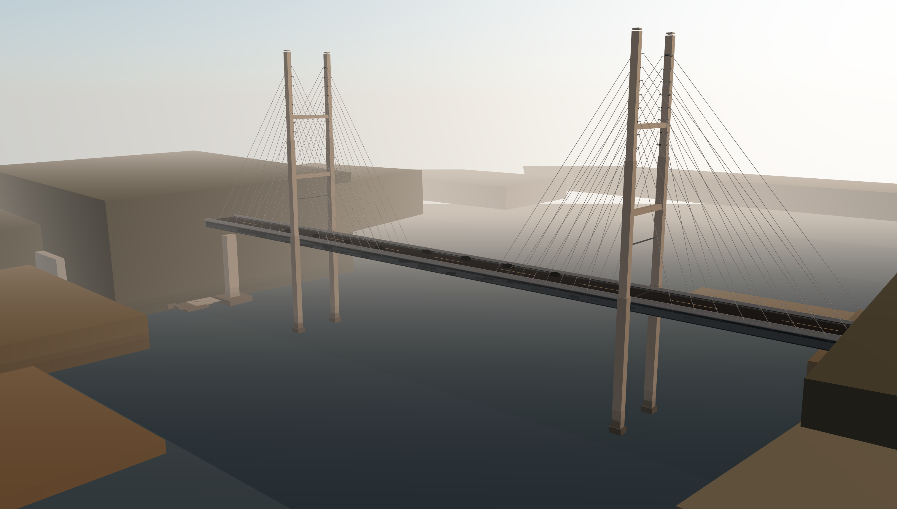

# Bridge Studio



Bridge Studio는 브라우저에서 사장교를 조정하고 탐색할 수 있는 파라메트릭 3D 프로젝트입니다. 프리셋과 구조 파라미터를 바꾸면 주탑, 케이블, 상판, 접속부가 함께 반응하도록 구성했습니다.

## 문제와 방향

정적인 3D 모델을 보여주는 대신, 구조 파라미터가 시각 결과에 어떻게 연결되는지 바로 확인할 수 있는 브라우저 실험실을 목표로 했습니다. 사용자는 전체화면 뷰포트 안에서 사장교 형상을 조정하고, 카메라를 이동하고, 현재 장면을 이미지로 저장할 수 있습니다.

## 주요 기능

- 사장교 구조 파라미터 조절
- `Compact`, `Balanced`, `Monumental` 프리셋
- `Hero`, `Front`, `Side` 카메라 프리셋
- Orbit, 휠 줌, `WASD` 이동
- PNG export
- URL 공유용 상태 직렬화
- last session 복원
- 로컬 preset 저장

## 구현 포인트

- 정적 모델 로드가 아니라 파라미터 기반 geometry 생성
- H형 주탑, 양측 케이블면, 박스거더, 교대와 접속부 구성
- 황혼 톤의 수변 장면과 저폴리 현장 구조물 배치
- enter gate 이후 scene을 lazy loading하는 staged boot 흐름
- bridge generation, layout, share state, manual chunk 전략을 테스트로 고정

## 기술 스택

| 영역 | 기술 |
| --- | --- |
| Frontend | React 19, TypeScript, Vite |
| 3D | Three.js, @react-three/fiber, @react-three/drei |
| State | Zustand |
| Test | Vitest, Testing Library, jsdom |

## 프로젝트 구조

```text
.
├─ src/
│  ├─ App.tsx
│  ├─ components/
│  │  ├─ BridgeControls.tsx
│  │  └─ BridgeScene.tsx
│  ├─ data/bridgePresets.ts
│  ├─ lib/
│  │  ├─ bridgeGenerator.ts
│  │  ├─ exportImage.ts
│  │  ├─ sceneLayout.ts
│  │  └─ shareState.ts
│  ├─ store/bridgeStore.ts
│  └─ types/bridge.ts
├─ docs/assets/
└─ docs/operations/
```

## 실행 방법

```bash
npm install
npm run dev
```

프로덕션 빌드:

```bash
npm run build
npm run preview
```

## 검증 명령

```bash
npm test -- --run
```

## 링크

- 저장소: [github.com/jinhyuk9714/bridge-demo](https://github.com/jinhyuk9714/bridge-demo)
